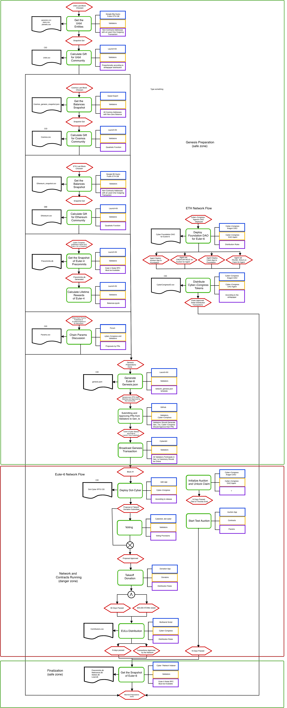

# Launch kit

An awesome, must-have toolkit and a protocol for the Genesis launch. This toolkit provides a launch protocol to cosmos-based networks. A recommended workflow and the necessary tools for the compilation of `genesis.json`. It also includes a crisis protocol.

The network launch is a complex process with many complex factors. It starts with distribution development and does not conclude with the first block of the network. 

This repo is an example of a working launch process of [cyber](https://cyber.page/). It is not a unique method for launching all types of projects, but the experience that we share can be very useful to others.

## ToC

- [Launch protocol](#launch-protocol)
- [Workflow](#workflow)
- [Tools](#tools)
- [Network params](#network-params)
- [Distribution params](#distribution-params)
- [Points of truth](#points-of-truth)

## Launch protocol

The protocol has three zones:

- Genesis preparation
- Network and contracts running
- Finalization

The Genesis preparation zone is used for collecting addresses for distribution, distribution parameters, network parameters, and genesis transactions. All the collected data is integrating into `genesis.json`, using the `network_genesis.json` template. 

This zone is also about set upping [a DAO](https://github.com/cybercongress/cyber-foundation) as a future, governing entity.

The network and contracts running zone is the stage between block #1 of the launch and the latest block of the network. The latest block is defined by the results of the takeoff donation round. In other words: the latest block should come after all of the pending DAO commitments. This zone is defined as a danger zone because of a possible fault risk of the network, the contracts or both of them.

This zone contains three major events:

- Deploying the web app for interacting with the network and DAO functions
- Start of the takeoff donation round
- Deploying Auction contracts 
- Token distribution

The finalization zone should be used after token distribution (as pended commitment). The main event of this zone is preparing for the mainnet.

## Workflow

1. Develop your distribution for the launch. This is the most important step in this guide. What is the total genesis supply?
 Which communities should be involved? How to distribute tokens? What method for distribution you want to use? How many tokens you want to distribute to the foundation, team, donors, inventors and so on. You can see our example at the [distribution](./distribution/README.md) directory.

2. According to your distribution, set up the `cyber_distribution.json` and `manual_distribution.json` files with the necessary values. More about that in the  [distribution](./distribution/README.md) directory. 

3. Set the parameters for the network. In the [params](./params/README.md) directory you are welcome to open discussions about your great params decisions. Put all the params inside of the `network_genesis.json`. 

4. Select a set of tools for preparing the genesis accounts. This refers to communities gifts if your distribution includes any gifts for communities (like ours). There are two ways to include a group of addresses in the genesis file: 

- Using the genesis-generator-tool built-in method (quadratic function)
- Using a custom method

In the first case, you just need a `.csv` file with the addresses and the native chain balances. The genesis-generator tool will parse the distribution files and apply the quadratic function for this group. 

> Notice. The addresses should be converted into the format that is suited to your network. For further details, see the provided [converter](./cyber_address_converter/README.md).

In the second case, you can calculate the balances as you wish, and the genesis generator tool just inserts it in the right format. But you should take care of the distribution sum by yourself. This sum should be compatible with the values at `cyber_distribution.json`. More technical details in the [genesis-generator-tool](./genesis-generator-tool/README.md). 

5. After you have prepared all the files you need to move them to the `genesis-generator-tool/data` and start the genesis generation.

## Tools

- [The Game rewards tools](./game_rewards_calculations/README.md) for calculating rewards after an incentivized game
- [ETH and Cosmos to Cyber converter](./cyber_address_converter/README.md). `ETH -> cosmos-based` addresses converter and `cosmos-based -> cosmos-based` converter
- [ETH gift distributor](./ethereum_gift_tool/README.md) for collecting non-contract, Ethereum addresses with at least one outgoing transaction, on a given block height
- [Cosmos gift distributor](./cosmos_gift_tool/README.md) for parsing Cosmos addresses from the file with the exported, on a given block height
- [Urbit gift distributor](./urbit_gift_tool/README.md) for collecting Urbit entities on a given block height, getting their owners and distributing gifts
- [Genesis generator](./genesis_generator_tool/README.md) for generating the genesis file
- [Data exporters](./cyberlink_exporter/README.md) for exporting data from the network. You can export cyberlinks by account using a given block height

## Network params

The network params are available at the `params` [README](/params/README.md)

## Distribution params

The distribution params are available at the `distribution` [README](/distribution/README.md)

---

## Points of truth

|File name | Description | IPFS hash | 
| ---------|-------------|-----------|
| cosmos.csv | cosmos network balances state at block 1110000 |  QmcgfjcNwucHrSrWFNxKGYLjLouedYjyeP3hRrqD6P8m9K |
| ethereum.csv | State of the Ethereum network balances on block 8080808, excluding contracts and addresses without, at least, one outgoing transaction | QmVCMwK3273Wb4gddzmxiitquCe844Qe63SWVyWFA8gEsT |
| galaxies_balance.csv | Galaxy balances for non-contract addresses with at least one outgoing transaction, on block 9110129 | QmR7nbMZDrQE5wLoUhgKJ6pZiUkCyJ4bCfgDEyWGfH3SvJ |
| stars_balance.csv | Stars balances of non-contract addresses, with at least one outgoing transaction, on block 9110129 | QmUkXZcHB9L3cg2uqMC5ejkCaD3eWsZRmyuWtdATxZUMKj |
| planets_balance.csv | Planet balances of non-contract addresses, with at least one outgoing transaction, on block 9110129 | QmZjc2KEQMpvK3dudsyar1Qzq6e4M5ds3CCteUXbne6zxs |
| Unsigned euler-6 genesis.json | | QmYrZuyMvskb2tkY65Go1Dadh1axXjY4x3VfFadaSSRf8b |
| cyber_distribution | Distribution by user group for euler-5/6 | QmfW6pEsHnC76ZWwGgtbhnRq4fJrUdiU9tz9M2oUnw3JNr |
| manual_distribution.json | Manual distribution inside of the groups for euler-5/6 | QmbEX1yNqCXbLF9fqQbJrE58zm4EXF2A8K6WDy9LjXSecd |
| network_genesis.json | The genesis.json template with current params for euler-6 | QmNboiSbS4TP6xptek6uyUnuxL3uL4Xef9qbyR7BvuH8Sf |
| cyberlinks.json | Euler-5 cyberlinks by address on block 1580000 block | QmNsDrgrJfGvs4Z6mg7XU5KMjg49FGtjUET1NqNoCynrzP |
| precommits.csv | Precommit count by validators on euler-5 testnet on block 1580000 | QmdfktVx9jpRx45WTAW9YkfbVijr2pC1AyvuhcS2bSgULk |
| Signed euler-6 genesis.json | | QmZHpLc3H5RMXp3Z4LURNpKgNfXd3NZ8pZLYbjNFPL6T5n |
